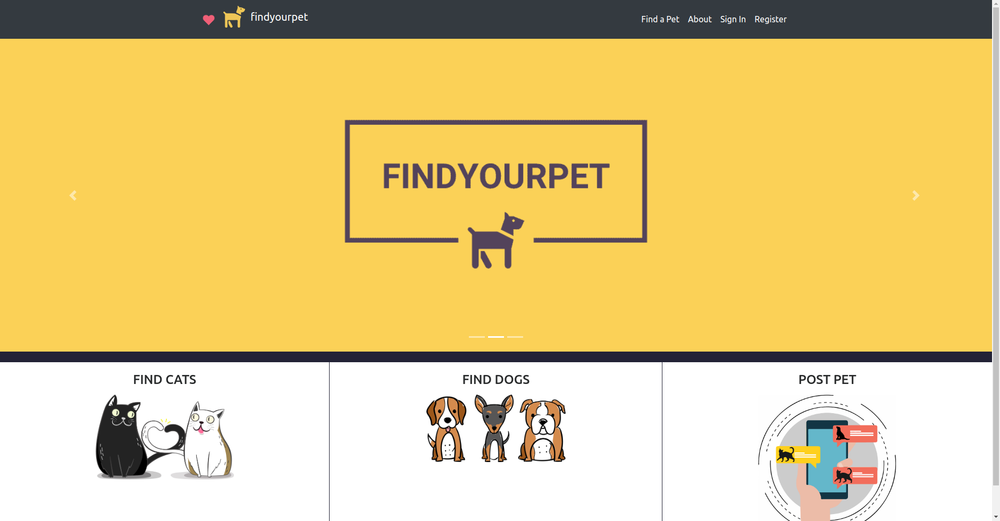
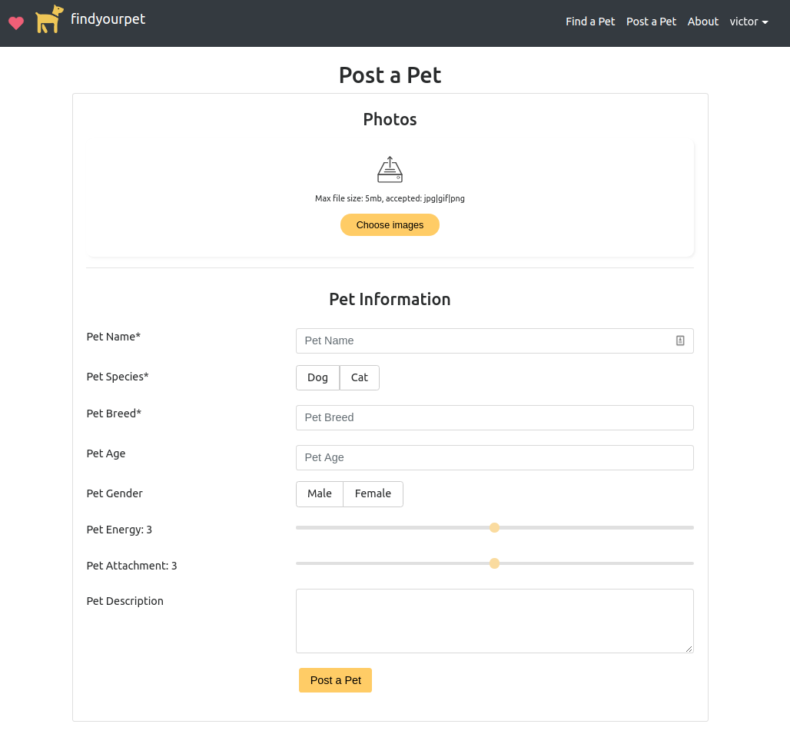

# FindYourPet

FindYourPet is a web application for posting and adopting pets. Unlike other pet adoption sites that tend to be exclusive to shelters and organizations, FindYourPet allows for individual breeders or owners that would prefer a more personal adoption procedure for their pets. 

The application allows for various search criterias to find your perfect pet. Some of these include the age, breed, species, attachment level, and even energy levels depending on how active of a pet the user wants. 

The user can be interested in a pet by clicking a button that will alert the owner of their interest. A profile page is available to users which will list the pets that they posted, the pets that they are interested in, and the people that are interested in their pet(s). From this page the owner of a pet can choose an interested adopter.

## Running the application
FindYourPet is created on an ExpressJS/Sequelize and React/Bootstrap stack. Running the application requires both the React and Express server to be available.

Required:
- Node v8.11+
- Web Browser

To run the application:
- Install NPM packages in both `backend/` and `frontend/` directories: `npm install`
- Run the backend server from the `backend/` directory: `npm start`
- Run the frontend server from the `frontend/` directory: `npm start`

Documentation for the FindYourPet API can be found [here](https://github.com/vhong000/FindYourPet/wiki/FindYourPet-Backend-API-Documentation).

## Project Members
- Daniel Constantine 
([Github](https://github.com/daniel-constantine), [LinkedIn](https://www.linkedin.com/in/danielconstantine/))
- Victor Hong
([Github](https://github.com/vhong000), [LInkedIn](https://www.linkedin.com/in/vhong000/))
- Joel Franco
([Github](https://github.com/FrancoJ101), [LInkedIn](https://www.linkedin.com/in/joelfranco18/))
- Irina Federova
([Github](https://github.com/irinafedorovacisc), [LInkedIn](https://www.linkedin.com/in/irinafedorovany/))

## Screenshots

